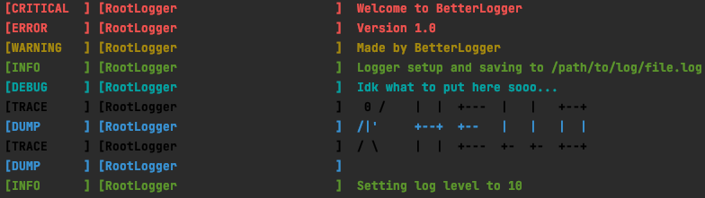

# BetterLogger
#### The best option for customizable and simplicity!

## Config
All parts of the logger can be configured via environment variables.

### Required
* `"APPNAME"` - defaults to `"BetterLogger"`
* `"APPAUTHOR"` - defaults to `"BetterLogger"`
* `"APPVERSION"` - defaults to `"1.0"`
* `"SHORT_APPNAME"` - defaults to `"BL"`

### Logging Stuff
* `"LOG_LEVEL"` - defaults to `10`
* `"LOG_FORMAT"` - defaults to `"%LEVEL_COLOR[%BOLD{level: <10}]%RESET %LEVEL_COLOR[%BOLD{class_name: <32}]%RESET %LEVEL_COLOR {message}%RESET"`

### Saving Logs
* `"LOG_SAVE_DIR"` - defaults to `appdirs.user_log_dir(appname=appname, appauthor=appauthor, version=appversion)`
* `"LOG_FILE_NAME_FORMAT"` - defaults to `"{appname}_{year}-{day}-{hour}-{minute}_{number}.log"`
* `"DISABLE_WELCOME_LOGGING"` - 
  * BetterLogger sends some welcome text to introduce the program and to test the logger
    
  * defaults to `False`

## Colors
BetterLogger comes with 9 colors, and 2 other text modifiers. There is black, red, green, yellow, blue, magenta, cyan, 
white, bold and reset. These can be accessed in logging by using the `%` sign and then writing the color name in all 
caps and then using the reset code, e.g. e.g. `%REDHelloWorld%Reset`
